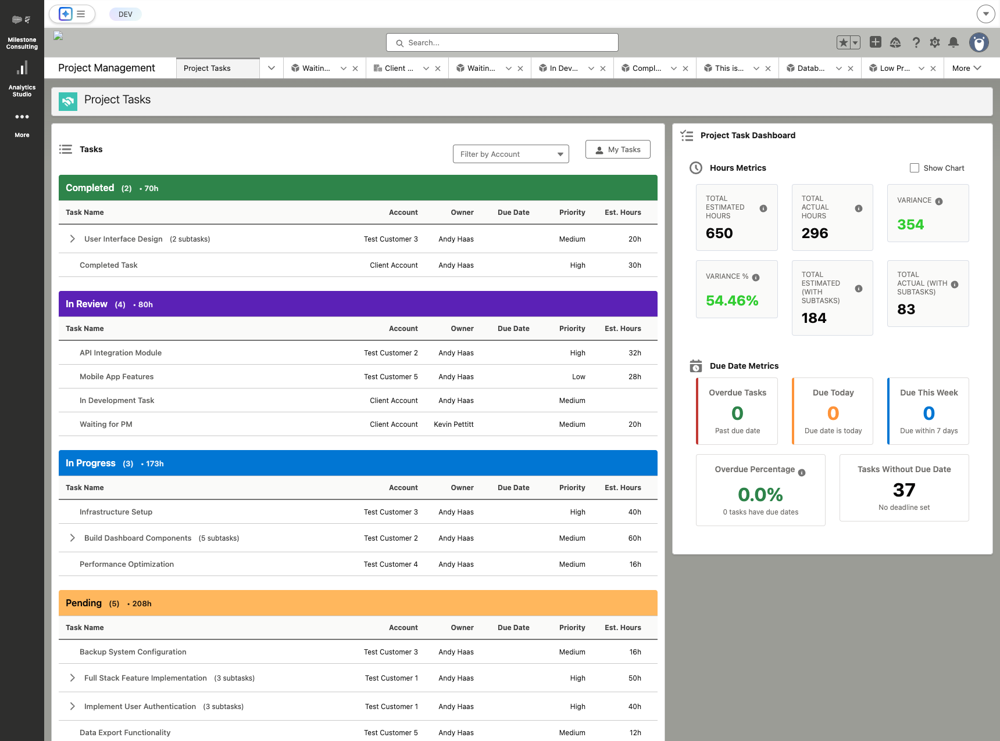
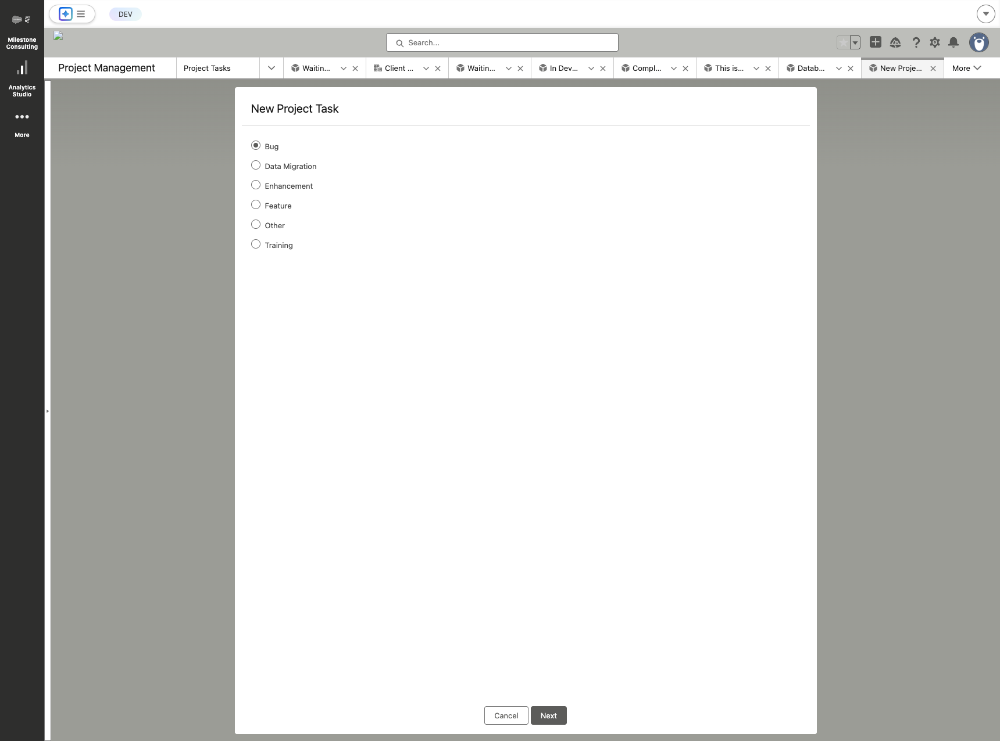
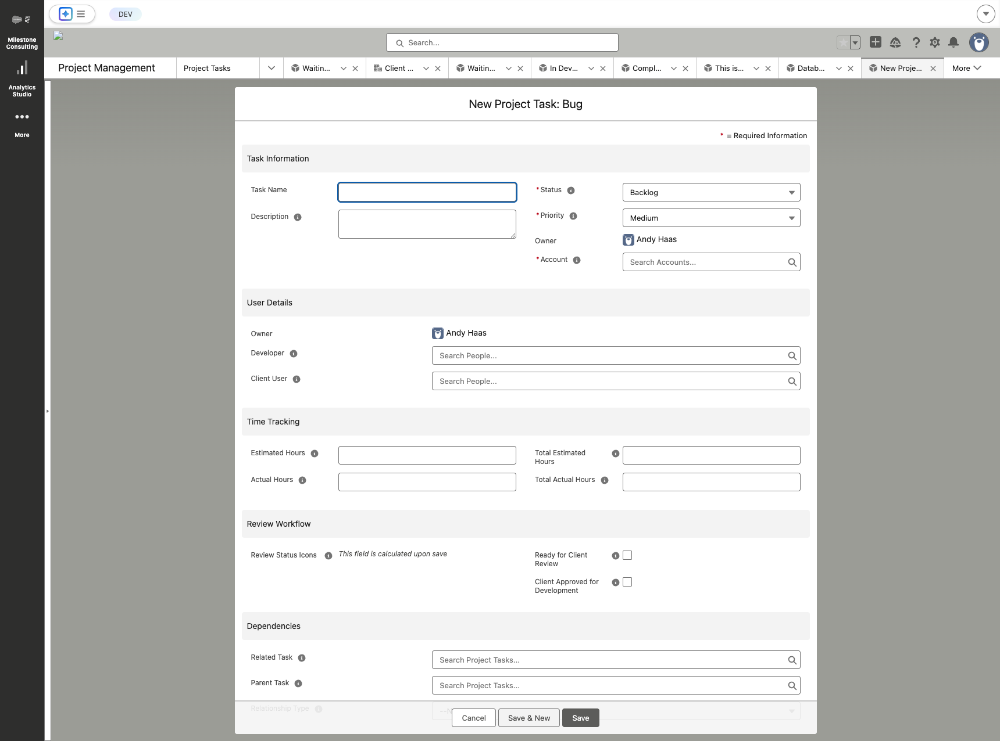
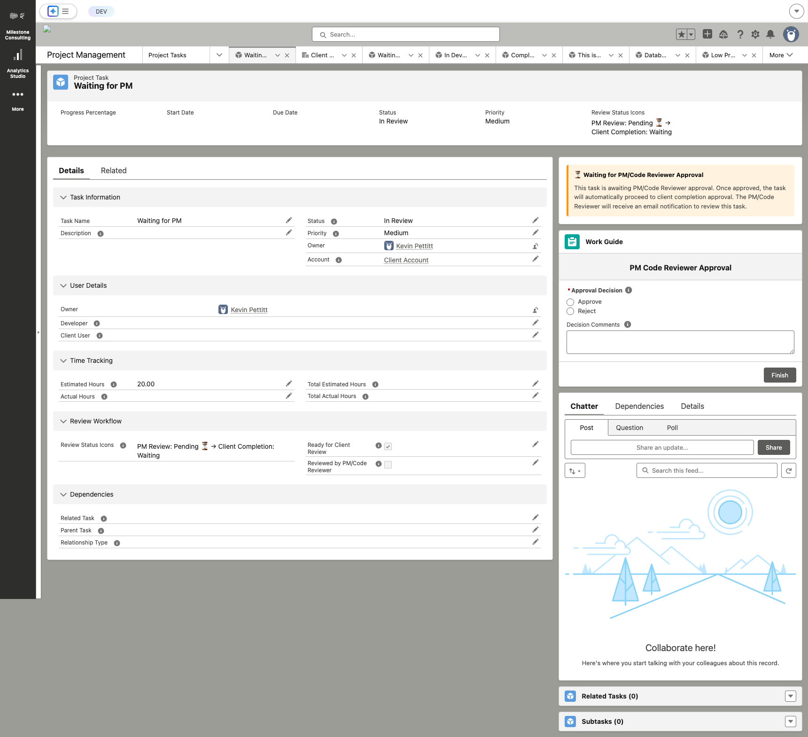

# User Guide

Complete guide to using the Milestone Task Management System. This document covers all features and functionality available to end users.

## Table of Contents

1. [Task Management](#task-management)
2. [Task Relationships](#task-relationships)
3. [Progress Tracking](#progress-tracking)
4. [Time Tracking](#time-tracking)
5. [Review and Approval Workflows](#review-and-approval-workflows)
6. [Dashboard and Analytics](#dashboard-and-analytics)
7. [Release Management](#release-management)
8. [Best Practices](#best-practices)

## Task Management

### Creating Tasks

#### Basic Task Creation

**Step 1: Navigate to Project Tasks**
1. Open the **Project Management** app
2. Click on **Project Tasks** in the navigation menu
3. You'll see the main dashboard with tasks organized by status



**Step 2: Click New Button**
1. Locate the **"New"** button in the top-right area of the list view
2. Click it to start creating a new task

**Step 3: Select Record Type**


1. You'll first see a screen to select the **Record Type**
2. Choose the appropriate type:
   - **Bug**: Fixing defects or issues
   - **Feature**: New functionality
   - **Enhancement**: Improving existing features
   - **Data Migration**: Data-related work
   - **Training**: Training materials or sessions
   - **Other**: Anything that doesn't fit the above
3. Click **"Next"** to proceed

**Step 4: Fill in Task Details**


Fill in the required fields (marked with red asterisk):
- **Task Name**: Clear, descriptive name
- **Account**: Customer account (use lookup to search)
- **Status**: Initial status (usually "Backlog")
- **Priority**: High, Medium, or Low

**Optional but Recommended Fields:**
- **Description**: Detailed explanation of the task
- **Developer**: Assign to a developer
- **Client User**: Assign to a client contact
- **Estimated Hours**: Initial time estimate
- **Due Date**: Target completion date
- **Start Date**: When work should begin

**Step 5: Save the Task**
1. Click **"Save"** button at the bottom of the form
2. You'll be taken to the task detail page

### Viewing Tasks

After creating or clicking on a task, you'll see the task detail page:



The task detail page includes:

**Highlight Panel** (top section):
- Task name and key information
- Progress percentage (for parent tasks)
- Status and priority indicators
- Review status icons
- Quick action buttons

**Details Tab**:
- **Task Information**: Name, description, status, priority
- **User Details**: Owner, developer, client user assignments
- **Time Tracking**: Estimated and actual hours (with rollup totals for parent tasks)
- **Review Workflow**: Review status and approval checkboxes
- **Dependencies**: Related tasks and parent task relationships

**Related Tab**:
- **Related Tasks**: Tasks that are related or dependent
- **Subtasks**: All subtasks for this parent task
- **Dependency Visualizer**: Visual map of task dependencies (if component is configured)

**Chatter Tab**:
- Comments and updates
- @mentions and notifications
- File attachments

**Work Guide**:
- Step-by-step guidance for approval workflows
- Approval decision forms
- Status indicators

#### Task Record Types

Choose the appropriate record type based on the work:

- **Bug**: Fixing defects or issues
- **Feature**: New functionality
- **Enhancement**: Improving existing features
- **Data Migration**: Data-related work
- **Training**: Training materials or sessions
- **Other**: Anything that doesn't fit the above

### Editing Tasks

1. Open the task record
2. Click **Edit** button
3. Modify fields as needed
4. Click **Save**

**Note**: Some fields may be read-only based on your permissions or the task's current status.

### Task Fields Explained

#### Core Fields

- **Task Name**: Short, descriptive title
- **Description**: Detailed explanation of the task
- **Account**: Customer account this task belongs to
- **Status**: Current state in the workflow
- **Priority**: High, Medium, or Low
- **Record Type**: Category of work

#### Assignment Fields

- **Developer**: Person responsible for completing the task
- **Client User**: Client contact for this task
- **Has Developer**: Automatically set when developer is assigned
- **Has Client User**: Automatically set when client user is assigned

#### Dates

- **Start Date**: When work should begin
- **Due Date**: Target completion date
- **Is Overdue**: Automatically calculated if past due date

#### Time Tracking

- **Estimated Hours**: Initial time estimate
- **Actual Hours**: Time actually spent (update as you work)
- **Total Estimated Hours**: Sum of all subtask estimates (rollup)
- **Total Actual Hours**: Sum of all subtask actual hours (rollup)

#### Progress

- **Progress Percentage**: Automatically calculated based on subtask completion
- **Parent Task**: If this is a subtask, link to parent
- **Has Parent Task**: Automatically set when parent is assigned

#### Dependencies

- **Related Task**: Another task this one relates to
- **Relationship Type**: Type of relationship (see [Task Relationships](#task-relationships))
- **Has Related Task**: Automatically set when related task is assigned
- **At Risk Due to Dependencies**: Automatically flagged if blocked
- **Is Blocking**: Indicates if this task blocks others

#### Review Fields

- **Ready for Client Review**: Check when ready for client approval (Backlog tasks)
- **Client Approved for Development**: Set when client approves (Backlog †’ Pending)
- **Reviewed by PM/Code Reviewer**: Set when internal review complete (In Review tasks)
- **Client Approved for Completion**: Set when client approves completion (In Review †’ Completed)

#### Release Management

- **Release Notes**: Link to release notes document
- **Has Release Notes**: Automatically set when linked
- **Release Notes Done**: Check when release notes are complete

### Subtasks

Subtasks break down larger tasks into manageable pieces.

#### Creating Subtasks

1. Open the parent task
2. Scroll to **Subtasks** related list
3. Click **New** in the subtasks section
4. Fill in subtask details (same as regular task)
5. The **Parent Task** field is automatically set
6. Click **Save**

#### Subtask Behavior

- Subtasks automatically calculate parent task progress
- Parent task progress = (Completed subtasks / Total active subtasks) × 100
- Removed subtasks are excluded from progress calculations
- Hours roll up from subtasks to parent

## Task Relationships

### Types of Relationships

#### Blocking Dependency

One task **must** be completed before another can start.

**Example**: "Deploy Database Schema" blocks "Run Data Migration"

- If the blocking task is not completed, the dependent task is marked as "At Risk"
- The blocking task shows "Is Blocking = true"
- Status changes on blocking tasks automatically update dependent tasks

#### Related Task

Tasks are related but don't have a blocking relationship.

**Example**: "Design Login Page" is related to "Implement Login Feature"

### Creating Relationships

1. Open the task that depends on or relates to another
2. Find **Related Task** field
3. Select the related task
4. Choose **Relationship Type**:
   - **Blocking Dependency**: This task cannot start until related task completes
   - **Related Task**: General relationship
5. Click **Save**

### Dependency Visualizer

The Dependency Visualizer component shows:
- Tasks that block this task
- Tasks blocked by this task
- Visual representation of the dependency chain

**To view**:
1. Open a task record
2. Scroll to the **Dependency Visualizer** component
3. See the visual map of dependencies

## Progress Tracking

### Automatic Progress Calculation

Progress is automatically calculated for parent tasks based on their subtasks:

```
Progress = (Completed Subtasks / Total Active Subtasks) × 100
```

**Notes**:
- Only subtasks with status "Completed" or "Closed" count as completed
- Subtasks with status "Removed" are excluded from calculations
- Progress updates automatically when subtask status changes

### Manual Progress Updates

For tasks without subtasks, you can manually track progress, but the system primarily uses subtask completion for accuracy.

### Progress Indicator Component

The Progress Indicator shows:
- Visual progress bar
- Percentage complete
- Number of completed vs. total subtasks

## Time Tracking

### Estimating Hours

When creating a task:
1. Enter **Estimated Hours** based on your best guess
2. Consider complexity, dependencies, and similar past tasks
3. Update if requirements change

### Recording Actual Hours

As you work on a task:
1. Open the task record
2. Update **Actual Hours** field
3. Add time incrementally (e.g., if you worked 2 hours, add 2 to existing value)
4. Click **Save**

**Best Practice**: Update hours daily or at task completion.

### Hours Rollup

For parent tasks:
- **Total Estimated Hours**: Sum of all subtask estimated hours
- **Total Actual Hours**: Sum of all subtask actual hours
- Automatically calculated and updated

### Hours Metrics Dashboard

View hours analytics:
- Total estimated vs. actual hours
- Hours by status
- Hours by priority
- Hours trends over time

## Review and Approval Workflows

### Workflow 1: Backlog †’ Pending (Client Development Approval)

**Purpose**: Get client approval before starting development work.

**Steps**:

1. **PM Submits for Review**
   - Task is in **Backlog** status
   - PM checks **Ready for Client Review** checkbox
   - Approval process is triggered

2. **Client Reviews**
   - Client receives approval request
   - Client can approve or reject

3. **If Approved**:
   - **Client Approved for Development** is automatically set to true
   - Status automatically changes to **Pending**
   - Task is ready to begin

4. **If Rejected**:
   - Status remains **Backlog**
   - **Ready for Client Review** may remain checked
   - PM can address feedback and resubmit

### Workflow 2: In Review †’ Completed (PM Review + Client Completion Approval)

**Purpose**: Ensure quality through internal review and client sign-off before marking complete.

**Steps**:

1. **Task Moves to In Review**
   - Developer changes status to **In Review**
   - Work is complete, awaiting review

2. **PM/Code Reviewer Approval**
   - Approval process is automatically triggered
   - PM/Code Reviewer reviews the work
   - Upon approval: **Reviewed by PM/Code Reviewer** is set to true

3. **Client Completion Approval**
   - After PM review, client approval process is triggered
   - Client reviews completed work
   - Upon approval: **Client Approved for Completion** is set to true
   - Status automatically changes to **Completed**

4. **If Rejected**:
   - Status may change back to **In Progress**
   - Developer addresses feedback
   - Process repeats

### Quick Actions

Use Quick Actions for common review operations:
- **Mark Reviewed by PM/Code Reviewer**: Quickly mark internal review complete
- **Mark Reviewed by Client**: Quickly mark client review complete
- **Generate Release Notes**: Create release notes for completed tasks

## Dashboard and Analytics

### Accessing the Dashboard

1. Navigate to **Project Management** app
2. Go to **Project Task Home Page** (or Account record page with dashboard)
3. View all metrics and components

### Dashboard Components

#### Status Breakdown
- Pie or bar chart showing tasks by status
- Quickly see distribution of work
- Click segments to filter tasks

#### Priority Breakdown
- Tasks grouped by priority (High, Medium, Low)
- Identify high-priority work
- Track priority distribution

#### Hours Metrics
- Total estimated vs. actual hours
- Hours by status
- Hours by priority
- Visual charts and summary cards

#### Progress Metrics
- Average progress percentage
- Tasks by progress range
- Progress trends

#### Review Status Metrics
- Tasks awaiting review
- Review status breakdown
- Approval pipeline

#### Due Date Metrics
- Tasks due today
- Tasks due this week
- Overdue tasks
- Upcoming deadlines

#### Task List Component
- Filterable, sortable task list
- Quick actions
- Status updates
- Direct navigation to task records

### Account Filtering

When the dashboard is on an Account record page:
- Automatically filters to that account's tasks
- Account filter component is hidden

On other pages:
- Use Account Filter component to select accounts
- Multi-select supported
- All components update automatically

## Release Management

### Creating Release Notes

1. Navigate to **Release Notes** tab
2. Click **New**
3. Fill in:
   - **Title**: Release name/version
   - **Description**: What's included
   - **Release Version**: Link to version record
   - **Release Tag**: Link to tag record
4. Click **Save**

### Linking Tasks to Release Notes

1. Open a task
2. Find **Release Notes** field
3. Select the release notes record
4. Click **Save**
5. **Has Release Notes** is automatically set

### Marking Release Notes Complete

1. Open the task
2. Check **Release Notes Done** when notes are finalized
3. Click **Save**

## Best Practices

### Task Creation

-  Use clear, descriptive task names
-  Provide detailed descriptions
-  Set realistic estimates and due dates
-  Assign developers and client users
-  Choose appropriate record type and priority

### Task Organization

-  Break large tasks into subtasks
-  Link related tasks
-  Identify blocking dependencies early
-  Keep parent tasks at high level, subtasks for details

### Progress Tracking

-  Create subtasks for accurate progress
-  Update subtask status as you work
-  Let the system calculate parent progress automatically

### Time Tracking

-  Estimate hours when creating tasks
-  Update actual hours regularly
-  Review hours metrics to improve estimates

### Communication

-  Use Chatter on tasks for updates
-  @mention team members for notifications
-  Add comments when changing status
-  Document decisions in task description

### Workflow Management

-  Follow the approval workflows
-  Don't skip review steps
-  Get client approval before starting work
-  Complete internal review before client review

### Dependencies

-  Identify dependencies early
-  Use blocking dependencies for critical paths
-  Monitor "At Risk" flags
-  Update blocking tasks promptly

---

**Need more help?** Check the [FAQ](./FAQ.md) or [Troubleshooting Guide](./Troubleshooting.md)

